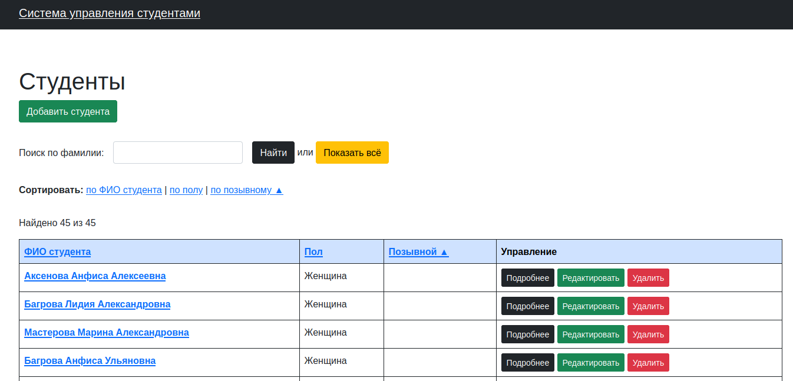

# Система управления студентами

### Демо-сайт

Для демонстрации работы проекта перейдите по ссылке https://students2021.herokuapp.com/

Или запустите проект локально на http://localhost:3000/

### Версия программного обеспечения

- Ruby: 2.7.2
- Ruby on Rails 6.1.0
- Development DB: SQLite
- Production DB: PostgreSQL

### Функционал

Панель управления позволяет просматривать, создавать, изменять и удалять студентов. Реализован поиск и сортировка.

### Внешний вид



### Запуск проекта

Проект поставляется файлом `seeds.rb` который заполняет базу данных тестовой информацией.

В каталоге проекта запустите миграции и сиды:

```bash
bundle install
rails db:migrate
rails db:seed
```

#### Запуск:

```bash
rails s
```

И, откройте в браузере: http://localhost:3000/

### Запуск тестов

Тесты написаны на Minitest. Запуск:

```bash
rails test
```
### Лицензия и автор:

**Автор:** Алексей Цаплин-Купайсинов (@krdprog)

**Лицензия:** MIT License
